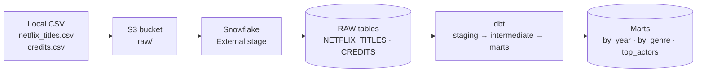

# DBT-Netflix
End-to-end ELT project: AWS infrastructure provisioned with Terraform, the Netflix titles + credits dataset loaded into Snowflake via S3, and transformed with dbt.
<p align="center">
  
  
  
  
  
</p>

<h1 align="center">Netflix dbt + Snowflake + AWS ELT Pipeline</h1>

<p align="center">
  An end-to-end ELT project: AWS infrastructure provisioned with <b>Terraform</b>, the
  Netflix titles and credits dataset loaded into <b>Snowflake</b> via <b>S3</b>, and
  transformed with <b>dbt</b> into analytics-ready marts.
</p>

<p align="center">
  
  
  
  
</p>

---

## Table of Contents

- [Overview](#overview)
- [Architecture](#architecture)
- [Repository Structure](#repository-structure)
- [Datasets](#datasets)
- [Data Model](#data-model)
- [Tech Stack](#tech-stack)
- [Prerequisites](#prerequisites)
- [Setup](#setup)
- [dbt Workflow](#dbt-workflow)
- [Data Quality & Testing](#data-quality--testing)
- [Roadmap](#roadmap)
- [License](#license)

---

## Overview

This project stands up a complete cloud ELT pipeline for the Netflix titles and
credits dataset, end to end:

```
local CSV ──▶ S3 (raw/) ──▶ Snowflake external stage ──▶ COPY INTO raw tables ──▶ dbt models
```

Infrastructure (an S3 bucket and the supporting IAM setup) is provisioned as code with
**Terraform**, so the environment is reproducible and disposable. Raw CSVs are loaded
into Snowflake through an external stage and `COPY INTO`, then modeled through a
staging → intermediate → marts layering in **dbt**, with tests enforced at every layer.

## Architecture

<p align="center">
  
  <br>
  <sub>local CSV → S3 (raw/) → Snowflake external stage → COPY INTO raw tables → dbt models</sub>
</p>



| Stage | Tool | Description |
|---|---|---|
| Infrastructure | Terraform | Provisions the S3 bucket and supporting AWS resources |
| Land | AWS CLI | Uploads local CSVs to `s3://<bucket>/raw/` |
| Stage | Snowflake external stage + storage integration | Points Snowflake at the S3 bucket via IAM role trust |
| Load | `COPY INTO` | Bulk-loads raw CSVs into `RAW.NETFLIX_TITLES` and `RAW.CREDITS` |
| Transform | dbt | Staging → intermediate → marts models, with tests and docs |

## Repository Structure

```
.
├── terraform/                   AWS (S3 bucket)
│   ├── main.tf  variables.tf  outputs.tf
│   └── terraform.tfvars.example
├── snowflake/
│   ├── ddl/                     Run in numbered order to set up Snowflake
│   │   ├── 01_create_database.sql       DB, schemas, warehouse, role, grants
│   │   ├── 02_create_stage.sql          storage integration, file format, stages
│   │   ├── 03_create_tables.sql         RAW.NETFLIX_TITLES, RAW.CREDITS
│   │   └── 04_load_data_into_tables.sql COPY INTO from S3
│   └── iam/                     AWS IAM policy templates (placeholders, no real IDs)
├── dbt/                          dbt project (profile: dbt_snowflake)
│   ├── models/
│   │   ├── staging/             stg_netflix_titles, stg_credits (+ sources, tests)
│   │   ├── intermediate/        int_netflix_titles_enriched
│   │   └── marts/                mart_titles_by_year, mart_titles_by_genre, mart_top_actors
│   ├── macros/                   generate_schema_name (lands models in real schemas)
│   ├── tests/                    generic (not_negative) + singular (assert_no_future_release_year)
│   └── profiles.example.yml
└── data/                          Source CSVs (credits, netflix_titles)
```

## Datasets

| Dataset | File | Key Field | Notes |
|---|---|---|---|
| Netflix Titles | `data/netflix_titles/netflix_titles.csv` | `show_id` (`s1`, `s2`, …) | Title, type, cast, country, release year, rating, duration, genre |
| Credits | `data/credits/credits.csv` | `id` (`tm84618`, …) | Person, character, role (actor/director) per title |

> **Note:** the two datasets use different ID schemes (`netflix_titles.show_id` = `s1…`
> vs `credits.id` = `tm84618`) and do **not** join. Each is modeled independently.

## Data Model

| Layer | Model | Materialization | Schema |
|---|---|---|---|
| staging | `stg_netflix_titles`, `stg_credits` | view | `STAGING` |
| intermediate | `int_netflix_titles_enriched` | view | `INTERMEDIATE` |
| marts | `mart_titles_by_year`, `mart_titles_by_genre`, `mart_top_actors` | table | `MARTS` |

## Tech Stack

| Layer | Technology |
|---|---|
| Infrastructure as Code | Terraform |
| Raw Storage | Amazon S3 |
| Data Warehouse | Snowflake |
| Transformation | dbt |
| Query Language | SQL |
| Version Control | Git |

## Prerequisites

- An AWS account with permissions to create an S3 bucket and IAM roles
- Terraform installed (`terraform >= 1.x`)
- A Snowflake account with `ACCOUNTADMIN` (or equivalent) access to create integrations
- `dbt-snowflake` installed (`pip install dbt-snowflake`)
- AWS CLI configured (`aws configure`)

## Setup

### 1. Provision AWS (Terraform)
```bash
cd terraform
cp terraform.tfvars.example terraform.tfvars   # fill in your values
terraform init
terraform apply
```

### 2. Upload the data to S3
```bash
aws s3 cp data/netflix_titles/netflix_titles.csv s3://<YOUR_BUCKET_NAME>/raw/netflix_titles/
aws s3 cp data/credits/credits.csv               s3://<YOUR_BUCKET_NAME>/raw/credits/
```

### 3. Set up Snowflake
Run the scripts in `snowflake/ddl/` in order (`01` → `04`). After `02_create_stage.sql`,
run `DESC INTEGRATION S3_DBT_INTEGRATION` and copy the `STORAGE_AWS_IAM_USER_ARN` and
`STORAGE_AWS_EXTERNAL_ID` into your AWS IAM role trust policy
(see `snowflake/iam/snowflake_trust_policy.json`).

### 4. Configure & run dbt
```bash
cp dbt/profiles.example.yml ~/.dbt/profiles.yml   # fill in account, user; set SNOWFLAKE_PASSWORD env var
cd dbt
dbt debug      # verify the connection
dbt run        # build all models
dbt test       # run data tests
```

## dbt Workflow

```bash
# Build everything: staging -> intermediate -> marts
dbt run

# Build only the marts layer
dbt run --select marts

# Run all tests (generic + singular)
dbt test

# Generate and browse documentation
dbt docs generate
dbt docs serve
```

Once `dbt run` completes, the mart tables are ready to query directly in Snowflake:

```sql
select release_year, count(*) as titles
from marts.mart_titles_by_year
group by release_year
order by release_year desc;
```

## Data Quality & Testing

| Test | Type | Applied to |
|---|---|---|
| `not_null` | generic | Primary keys and required fields across staging models |
| `unique` | generic | `show_id` in `stg_netflix_titles`, `id` in `stg_credits` |
| `not_negative` | generic (custom) | Numeric fields such as duration/release year |
| `assert_no_future_release_year` | singular (custom) | Fails if any title has a `release_year` beyond the current year |

## Roadmap

- [ ] Automate S3 uploads with a scheduled job instead of manual `aws s3 cp`
- [ ] Add incremental models for larger, regularly-refreshed datasets
- [ ] Add CI (GitHub Actions) to run `dbt build` on every pull request
- [ ] Expose the marts through a BI dashboard (e.g., Tableau, Looker, Streamlit)

<p align="center">
  <sub>Built with Terraform · AWS S3 · Snowflake · dbt</sub>
</p>
